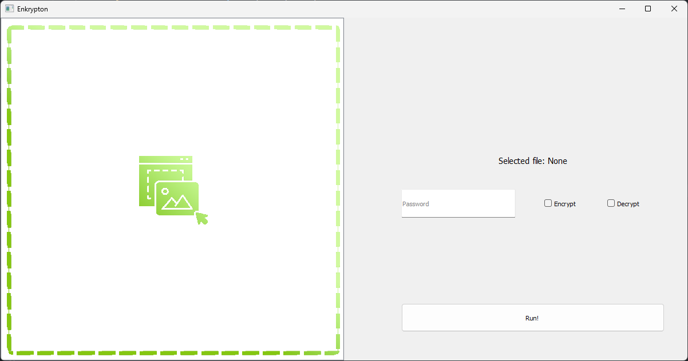

<p align="center">
    
</p>

<h1 align="center">Enkrypton</h1>
<h3 align="center">An open source encription and compression GUI.</h3>
<hr>

<p align="center">
    
</p>

## Requirements
![][python-shield]

## Install
The pre-built version for windows is available in the releases.

## Run with python (modify)

Clone the directory
```bash
git clone https://github.com/JuRxY/Enkrypton.git
cd Enkrypton
```
Install dependencies and run
```bash
pip install -r requirements.txt
python ui.py
```
Build executable (optional)
```bash
pip install pyinstaller
pyinstaller --noconfirm --onefile --windowed --name "Enkrypton" --icon "./assets/icon.ico" --add-data "./assets/dragndrop.png;assets"  "./ui.py"
```
Your executable will be generated at `./dist/Enkrypton.exe`

[python-shield]: https://img.shields.io/badge/Python-3.5^-green?style=for-the-badge&logo=python